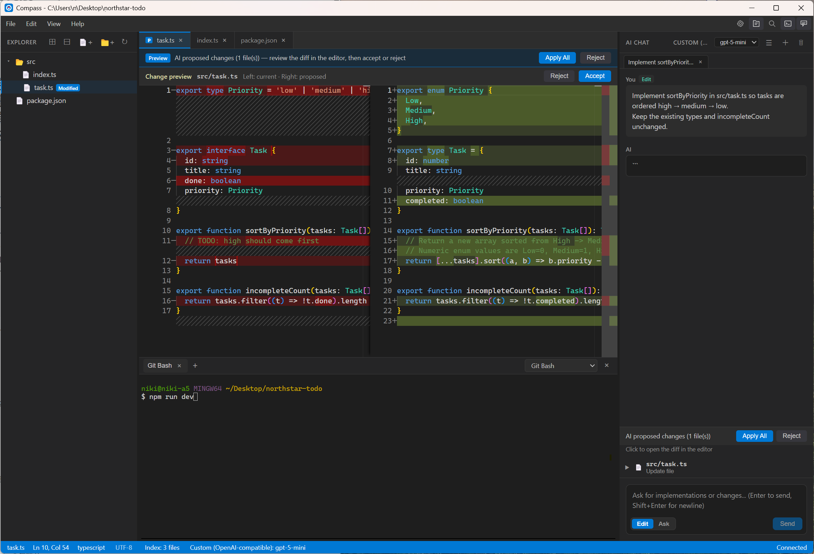

# Compass

[English](README.md) | **日本語**



Windows 向けの AI コードエディタです。ローカルのコードを編集しながら、AI と対話して書く・直すことができます。

フォルダを開く → ファイルを編集する → AI に質問する → 提案を適用する、という一連の流れをサポートします。

## Download

[Windows 版をダウンロード（最新）](https://github.com/niki-ikuo/compass/releases/latest)

インストーラ: `Compass Setup x.y.z.exe`（Windows 10/11 x64）

## Features

- Monaco Editor によるコード編集（シンタックスハイライト）
- ワークスペース単位のファイルツリー
- AI チャット（ストリーミング）— **Ask**（説明のみ）/ **Edit**（ファイル変更の提案 → プレビュー適用）
- プロジェクト構造索引（`.compass/`）を AI コンテキストに利用
- AI 提案の差分プレビューと適用
- 統合ターミナル（xterm.js）
- OpenAI 互換 API への接続設定（マルチ LLM: OpenAI / Gemini / DeepSeek / Groq / OpenRouter / Ollama / カスタム）

## Requirements

- Windows 10 / 11（x64）
- [Node.js](https://nodejs.org/) 18 以上
- npm

## Installation

```bash
git clone https://github.com/niki-ikuo/compass.git
cd compass
npm install
```

`npm install` 時に Electron バイナリのセットアップが自動で実行されます。

ネイティブモジュール（`node-pty`）のビルドに失敗する場合は、次を実行してください。

```bash
npm run rebuild-native
```

## Usage

### 開発モードで起動

```bash
npm run dev
```

### 本番ビルド

```bash
npm run build
```

### インストーラの作成

```bash
npm run dist
```

成果物は `release/` に出力されます（NSIS インストーラ）。

### 初回セットアップ

1. アプリを起動する
2. **設定** で LLM プロバイダ・API Key・モデルを選ぶ
3. **フォルダを開く** でワークスペースを選択する
4. ファイルを編集し、サイドパネルの AI チャットで質問・提案の適用を行う

## Scripts

| コマンド | 説明 |
|----------|------|
| `npm run dev` | 開発サーバー起動（electron-vite） |
| `npm run build` | 本番用ビルド |
| `npm run preview` | ビルド結果のプレビュー |
| `npm run dist` | ビルド + NSIS インストーラ作成 |
| `npm run rebuild-native` | `node-pty` のネイティブ再ビルド |

## Tech Stack

- **Electron** — デスクトップシェル
- **React** + **TypeScript** — UI
- **Monaco Editor** — コードエディタ
- **Zustand** — 状態管理
- **electron-vite** — ビルド
- **electron-builder** — パッケージング

## Project Structure

```
compass/
├── electron/       # メインプロセス・プリロード・サービス
├── src/            # レンダラー（React UI）
├── docs/           # 仕様・アーキテクチャなど開発ドキュメント
├── scripts/        # セットアップスクリプト
└── resources/      # アプリアイコンなど
```

## Documentation

英語版（正本）は [`docs/`](docs/) を参照してください。日本語版は [`docs/ja/`](docs/ja/README.md) にあります。

- [ドキュメント一覧](docs/ja/README.md)
- [製品仕様](docs/ja/SPEC.md)
- [アーキテクチャ](docs/ja/ARCHITECTURE.md)
- [開発ガイド](docs/ja/DEVELOPMENT.md)
- [コントリビューション](CONTRIBUTING.ja.md)（英語版: [CONTRIBUTING.md](CONTRIBUTING.md)）

## Contributing

コントリビューション歓迎です。[CONTRIBUTING.ja.md](CONTRIBUTING.ja.md) を参照してください。  
Issue / PR は **英語** を推奨しますが、日本語でも問題ありません。

[行動規範](docs/ja/CODE_OF_CONDUCT.md)（英語版: [CODE_OF_CONDUCT.md](CODE_OF_CONDUCT.md)）に従ってください。

## License

[MIT](LICENSE)
